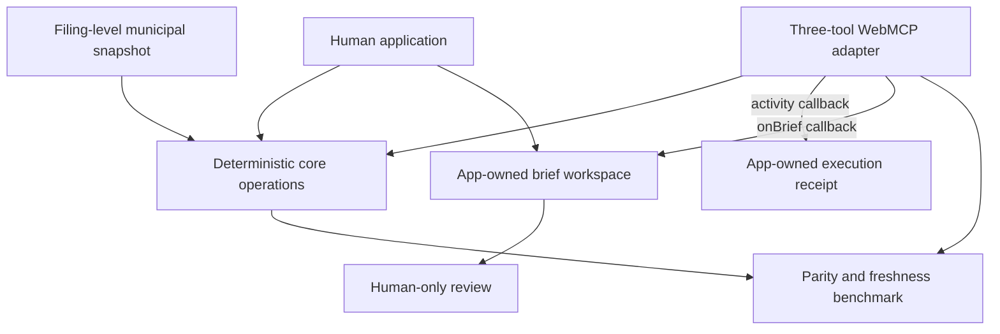
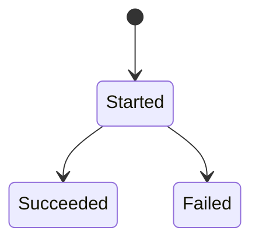
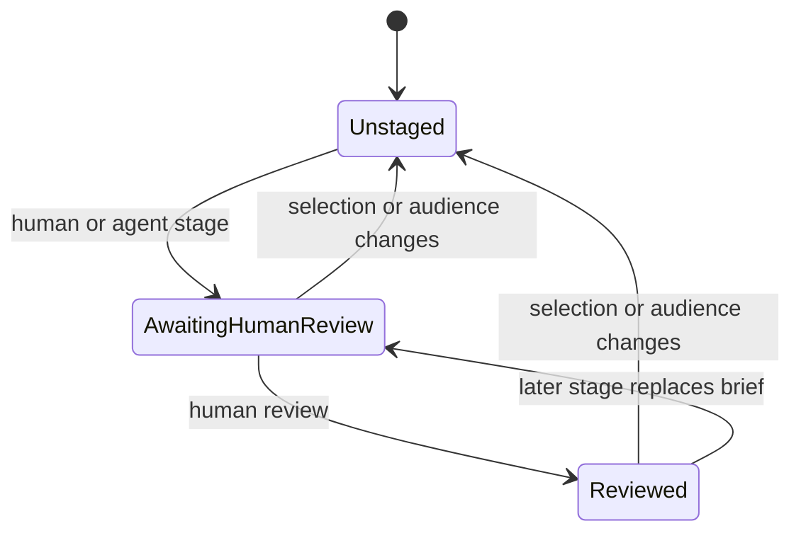
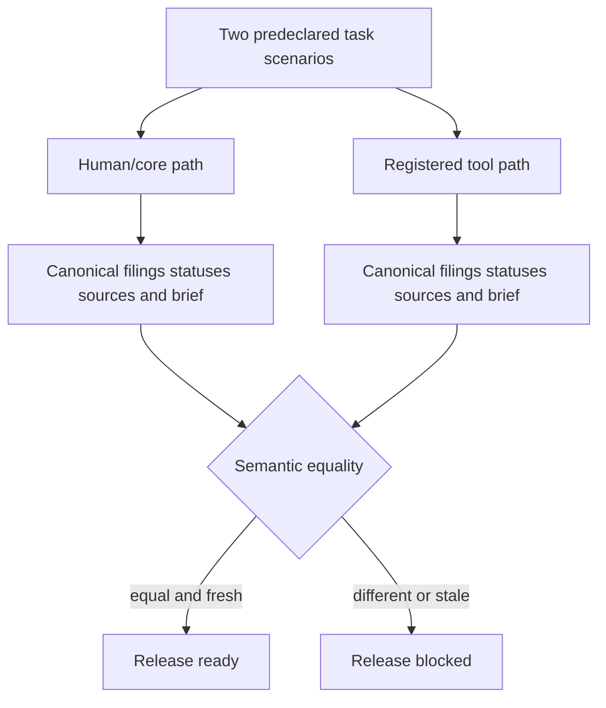

# Judge-Visible WebMCP Proof - Plan

## Goal Capsule

- **Objective:** Produce a release candidate in which a judge can reproduce one accountable municipal-planning task, see the real agent actions change the shared page, verify the same outcome through the human path, and understand why the product is distinct without relying on unsupported impact claims. Public judge visibility remains a separately authorized release milestone.
- **Means:** Add filing-level human/agent parity, handler-originated execution receipts, a fail-closed snapshot-freshness and outcome benchmark, and sourced positioning within the existing static application (KTD1-KTD6).
- **Authority:** Official WebMCP Challenge criteria and municipal records outrank local copy. Product requirements outrank implementation units. Existing factual guardrails outrank score optimization.
- **Execution profile:** Code change with test-first proof, candidate browser verification, and PR ownership through CI; production verification is conditional on separate release authority.
- **Stop conditions:** Stop before inferring a municipal outcome, adding an external write path, changing a public tool name or input schema, claiming observed time savings, or mutating Devpost or YouTube without separate authorization.
- **Tail ownership:** The executor owns local implementation, tests, candidate browser evidence, commit, push, PR, and CI. If freshness is due, official-record re-verification is a release prerequisite. Production deployment and public submission-media edits remain explicit external gates.

---

## Product Contract

### Summary

This plan makes the existing three-tool WebMCP workflow judge-visible and outcome-verifiable while preserving NWA Growth Signal as a source-bound, human-reviewed municipal-planning desk.
It also fixes the filing-selection mismatch that can reintroduce an unselected sibling filing into a later human restage.

### Problem Frame

The current product is compliant, deployed, and well tested, but its strongest proof lives in documentation and a handler benchmark.
The public page shows a suggested prompt and tool names, yet it does not show a receipt produced by real handler execution.
The benchmark proves handler behavior but does not compare the human and agent paths or fail when the dated municipal snapshot becomes due for re-verification.
The current record-level selection state can also collapse an agent-selected filing into its parent record, which weakens the filing-level accuracy claim.

### Actors

- A1. **Human reviewer:** Searches, inspects, stages, and records local review in the visible workspace.
- A2. **Browser agent:** Uses the three registered WebMCP tools against the same bounded records and workspace.
- A3. **Judge or evaluator:** Reproduces the workflow, inspects deterministic evidence, and evaluates the product against the official criteria.

### Key Decisions

- **Keep the product scoped to Bentonville and Rogers.** (session-settled: user-approved — chosen over switching markets or use cases: the deployed product and evidence are NWA-specific.) Governs R1, R2, R5, R8.
- **Preserve filing-level procedural truth and human review.** (session-settled: user-approved — chosen over inferred statuses or autonomous publication: the product differentiates through accountable source handling.) Governs R1, R3, R4, R5, R9.
- **Require designer-grade production presentation.** (session-settled: user-directed — chosen over generic or vibe-coded presentation: the user rejected generic asset UI.) Governs R2, R7, R8.
- **Use only participant-approved natural narration for public media.** (session-settled: user-directed — chosen over operating-system or robotic TTS: prior robotic narration was rejected.) Governs R10.
- **Keep the approved nine-section Devpost story as the copy baseline.** (session-settled: user-approved — chosen over the prior weak template story: the replacement is already live and verified.) Governs R10.
- **Do not depend on another person for validation at this stage.** (session-settled: user-directed — chosen over waiting for a practitioner pilot: the user requested a self-contained workstream.) Governs R6, R10.

### Requirements

**Shared filing-level workspace**

- R1. Human and agent paths must select and render exact filing IDs with their paired procedural statuses, including filtered and unfiltered multi-filing records.
- R2. The human search controls must expose the agent's `requires_action` filter and return the same ordered record set for the same filters.
- R3. An agent-staged brief must replace the visible selection with its exact requested filings without adding a sibling filing.
- R4. Final review must remain a human-only session action; no tool may review, publish, send, save, or persist externally.

**Judge-visible agent execution**

- R5. Each real tool execution must produce a bounded session-local receipt that shows invocation order, success or failure, and a safe result summary; workspace review state remains a separate human-owned lifecycle.
- R6. The workflow benchmark must prove semantic outcome parity across two predeclared scenarios and report defined interface-action compression without presenting the result as a user study, adoption evidence, revenue evidence, or elapsed-time savings.

**Truth, freshness, and positioning**

- R7. The application and release gate must derive one shared freshness state from the dated municipal snapshot and mark the release not ready when it is due without rewriting procedural statuses.
- R8. The public page must distinguish NWA Growth Signal's job from CivicPlus, Regrid, and PermitFlow using affirmative paraphrases and official product links only.
- R9. Existing source-domain, copy-baseline, non-claim, recommendation-versus-adoption, and human-review safeguards must remain fail-closed.

**Release evidence**

- R10. Repository evidence, demo guidance, and submission copy must point judges to the live receipt, parity benchmark, freshness state, and sourced comparison while preserving approved narration and public-story boundaries.
- R11. Existing WebMCP tool names, input schemas, annotations, validation, registration rollback, errors, and result meanings must remain compatible; freshness additions are additive.

### Key Flows

- F1. **Human task path**
  - **Trigger:** A1 opens the verified planning desk.
  - **Steps:** Apply action-needed filtering, inspect filing/status pairs, select exact filings, stage the brief, and record local review.
  - **Outcome:** The visible brief contains only the selected filings and remains local.
  - **Covered by:** R1-R4, R7.
- F2. **Agent task path**
  - **Trigger:** A2 receives the suggested task in a supported WebMCP host.
  - **Steps:** Search, inspect `RZ26-00511`, and stage the fixed three-filing brief through the registered handlers while the page records each call independently.
  - **Outcome:** The page receipt reflects real calls and the shared workspace awaits A1 review.
  - **Covered by:** R1-R7, R9.
- F3. **Freshness transition**
  - **Trigger:** The runtime or benchmark date passes the structured snapshot boundary.
  - **Steps:** Preserve the records, label them `reverification_due`, and fail release readiness.
  - **Outcome:** Historical inspection remains possible, but the release cannot claim current verification.
  - **Covered by:** R7, R9.

### Acceptance Examples

- AE1. **Single filing from a multi-filing record**
  - **Covers:** R1, R3.
  - **Given:** `VAR26-0397` is withdrawn and `RZ26-00511` is scheduled on one record.
  - **When:** The agent stages only `RZ26-00511` and the human later restages the visible selection.
  - **Then:** The new brief still contains only `RZ26-00511` with `Scheduled`; `VAR26-0397` is absent.
- AE2. **Real receipt with recovery**
  - **Covers:** R5.
  - **Given:** The agent issues one invalid inspection followed by the valid fixed workflow.
  - **When:** The handlers reject and then accept the calls.
  - **Then:** The failed receipt is visible, the valid calls remain usable, and no failure mutates the brief.
- AE3. **Stale snapshot without status invention**
  - **Covers:** R7, R9.
  - **Given:** The benchmark date is after the snapshot's structured boundary.
  - **When:** The same records are searched, inspected, and staged.
  - **Then:** Freshness is `reverification_due`, release readiness is false, and every procedural status is unchanged.
- AE4. **Human-only review**
  - **Covers:** R4, R5.
  - **Given:** The agent has staged the fixed brief.
  - **When:** No human selects `Mark as reviewed`.
  - **Then:** The workspace remains at `awaiting_human_review`, the immutable receipt rows remain `succeeded` or `failed`, and no registered tool can advance the workspace.

### Success Criteria

- The benchmark reports exact core/adapter outcome parity for both predeclared scenarios, three tool calls in the primary scenario, each raw action trace, the human-review boundary, and `release_ready: true` on the fresh fixture date.
- An expired fixture date changes only freshness and release readiness.
- A supported browser shows a real search-to-inspect-to-stage receipt and the exact three-filing brief in one continuous run.
- The public page explains adjacent products through sourced job-to-be-done language without unsupported superiority claims.
- The repository's internal evidence map identifies support for every official criterion, labels deterministic workflow compression as supporting Potential Impact, and explicitly records that adoption and observed user-effect evidence are absent. It never treats an internal score target as a guaranteed judge score.
- Each criterion entry names its claim, artifact, reproduction step, falsification condition, and observed result so the preflight cannot pass on self-assertion alone.

### Scope Boundaries

#### Deferred to Follow-Up Work

- Practitioner usability testing and observed elapsed-time measurement.
- Live municipal ingestion, broader Northwest Arkansas coverage, and durable run history.
- Re-recording or replacing the public YouTube video and editing the submitted Devpost entry.

#### Outside This Product's Identity

- Autonomous publication, sending, or external persistence.
- Inferred municipal outcomes, construction states, prices, appreciation, investment advice, or demographic targeting.
- Agent access to final review, CAPTCHA, authentication, or platform consent.

### Sources

- Official challenge page and criteria: `https://webmcp.devpost.com/`.
- CivicPlus agenda and meeting management: `https://www.civicplus.com/agenda-meeting-management/`.
- Regrid property application: `https://regrid.com/property-app`.
- PermitFlow permit application management: `https://www.permitflow.com/`.
- Existing implementation and evidence: `site/core.js`, `site/webmcp.js`, `site/app.js`, `scripts/benchmark.js`, `docs/hackathon/EVIDENCE.md`.

---

## Planning Contract

### Key Technical Decisions

- KTD1. **Keep exactly three public WebMCP tools and evolve results additively.** Wrap their existing handlers with internal activity events; do not add a workflow, retry, review, or publishing tool. Preserve every existing result key and meaning while adding consistently named freshness context for R7 and R11.
- KTD2. **Use filing IDs as the shared selection unit.** `activeRecordId` controls display and `selectedFilingIds` controls staging. A status-filtered record selects only `matching_filings`; an unfiltered multi-filing record exposes individual filing controls. Record IDs remain accepted as the existing select-all-filings convenience for R1-R3.
- KTD3. **Separate receipt events from workspace state.** Each real call gets a monotonic ID and one allowlisted row that moves from started to succeeded or failed. `app.js` owns a bounded receipt view and the staged-review lifecycle. Receipt-sink failure cannot change a domain result, while `onBrief` remains the authoritative stage side effect and a failed stage callback cannot report success.
- KTD4. **Centralize snapshot freshness as pure domain logic.** The current release has one validated ISO `reverify_on` boundary shared by all records. An injectable Northwest Arkansas civil-date string produces `current`, `verification_date_only`, or `reverification_due`. Add per-filing boundaries only when a future verified snapshot actually contains different review dates.
- KTD5. **Extend the existing fail-closed benchmark as adapter-regression evidence.** Compare canonical core and WebMCP-adapter results for two predeclared tasks, while a fake-DOM integration test exercises the named human controls for the primary task. Report raw interface-action traces and their derived counts, not independent factual validation or observed time savings; gate release readiness on both parity scenarios and freshness.
- KTD6. **Reuse the editorial design language for differentiation.** Add one concise comparison section with official links and affirmative product descriptions. No dependency or new visual system is justified.
- KTD7. **Keep public-channel mutation outside the PR.** Update repository artifacts and prepare any revised capture package, but stop before editing Devpost or replacing YouTube media without a new explicit authorization.

### Assumptions

- The fixed task remains the current demo task: action-needed residential search, inspection of `RZ26-00511`, and staging of `RZ26-0041`, `RZ26-00419`, and `RZ26-00511` for `Land and development`.
- The counter-scenario uses a Rogers `Withdrawn` residential search, inspection of `VAR26-0397`, and staging of `VAR26-0397` plus `RZ26-00345` for `Public-interest planning`. It tests a different filter, the other filing on the multi-filing record, and another audience without expanding the dataset.
- Snapshot freshness is an editorial release condition, not a claim that every cited municipal record changes on the boundary date.
- The action-count rule is interface-specific and atomic: one direct human control activation or one browser-agent tool invocation counts as one action. Both raw traces are published, every counted human action is exercised by the fake-DOM integration test, and the comparison is labeled specific to the declared script rather than general productivity evidence.
- The visible page can prove handler execution but cannot prove that the host passed the displayed suggested prompt to the page. The continuous demo must show the prompt in the agent host.
- The current official product pages are sufficient sources for a narrow job-to-be-done comparison; no claim about an absent competitor capability is allowed.
- `reverify_on` is an editorial release-review boundary, not an inferred municipal outcome. Tests inject ISO calendar dates; runtime code derives the America/Chicago civil date without UTC date parsing.

#### Additive freshness result contract

Every tool keeps its current keys and meanings and adds the same `freshness` object:

| Tool | Existing shape preserved | Additive `freshness` aggregation |
|---|---|---|
| `search_planning_cases` | `{ verified_at, results }` | The shared municipal snapshot. |
| `inspect_case_record` | The current record object | The shared municipal snapshot. |
| `stage_source_backed_brief` | `{ staged, review_required, item_count, message }` | The shared municipal snapshot; filing selection remains exact and never adds an unselected sibling. |

`freshness` is always `{ state, as_of, reverify_on }`: `state` is `current`, `verification_date_only`, or `reverification_due`; `as_of` is the injected or America/Chicago civil date in `YYYY-MM-DD`; `reverify_on` is the snapshot boundary or `null`.

#### Snapshot freshness contract

The shared snapshot is verified at `2026-08-25` and has `reverify_on: 2026-09-02`, the first review day after the published September 1 meeting cycle. The boundary is inclusive: `as_of >= reverify_on` is `reverification_due`. Missing boundary metadata yields `verification_date_only`, which is inspectable but not release-ready. Every record and brief displays the same snapshot freshness; freshness never changes a filing's procedural status.

### High-Level Technical Design

**Shared data and callback flow**

**Per-call receipt lifecycle**

**Workspace review lifecycle**

**Fixed benchmark evidence flow**

### System-Wide Impact

- **Data contract:** `site/core.js` centralizes the current snapshot metadata while `site/cases.json` preserves record provenance and procedural statuses. Per-filing boundaries remain deferred until official records require distinct dates.
- **UI contract:** Canonical filing selection changes counts, filtered-selection disclosure, focus restoration, staging invalidation, and filing/status rendering.
- **WebMCP contract:** Tool names and inputs remain stable. Outputs gain additive freshness context, activity events remain internal, and stage success still requires the visible `onBrief` side effect.
- **Trust boundary:** Receipt instrumentation is observational and best-effort. Domain validation, tool results, visible stage completion, and the human-only review gate remain authoritative.
- **Operational contract:** The live benchmark intentionally fails after the NWA freshness boundary until official records are reverified. Fixture tests remain deterministic through injected dates.
- **Evidence contract:** The agent host proves the prompt, the page proves handler execution, and neither surface claims the page received prompt text it cannot observe.
- **Release evidence:** The exact report test, README, evidence register, demo guidance, and submission draft must change in the same diff.
- **Deployment:** A green PR proves the candidate branch, not production. Production proof is reported only after an authorized deployment serves the candidate commit.

### Risks and Mitigations

- **Decorative proof:** A prefilled trace would undermine trust. Emit rows only inside real tool handlers and label the page prompt as suggested.
- **Selection regression:** Record-level state can reintroduce sibling filings. Add AE1 coverage before changing selection behavior.
- **Receipt safety:** Allowlist tool name, case IDs or filter values, result count, selected filing IDs, freshness, and review requirement. Exclude prompt text, stacks, source-page content, and arbitrary payloads.
- **Hostile receipt input:** Project only schema-validated, length-capped fields into a receipt. Invalid inputs and callback failures use generic typed failure codes; raw inputs, `error.message`, and stacks never reach receipt events or the DOM.
- **Freshness overclaim:** A cutoff can be mistaken for an official outcome. Change freshness only and retain the last verified statuses.
- **Adapter parity:** Both paths share core logic. Describe the benchmark as adapter regression and scripted interaction evidence, not independent factual validation.
- **Intentional red release:** Date-triggered failure can look nondeterministic. Use injected dates in tests and make the CLI name the re-verification recovery action.
- **Score certainty:** The implementation can maximize proof but cannot guarantee a judge's 20/20 score. Keep the internal preflight and public claims separate.

### Sequencing

U1 establishes red tests and filing/freshness domain contracts.
U2 makes the benchmark fail closed before new judge-facing copy depends on it.
U3 and U4 add runtime proof and presentation on the shared contracts.
U5 aligns documentation and capture guidance.
U6 verifies the local candidate before shipping the PR and performs production verification only after a separately authorized release.

---

## Implementation Units

### U1. Filing-level parity and freshness domain

- **Goal:** Make exact filing selection and snapshot freshness shared domain behavior.
- **Requirements:** R1-R3, R7, R9, R11; covers AE1 and AE3.
- **Dependencies:** None.
- **Files:** `site/cases.json`, `site/core.js`, `site/webmcp.js`, `site/app.js`, `site/index.html`, `tests/core.test.js`, `tests/data.test.js`, `tests/webmcp.test.js`, `tests/app.test.js`, `tests/ui.test.js`.
- **Approach:**
  1. Add one validated snapshot `reverify_on` boundary without changing verified statuses or affirmative copy.
  2. Centralize date evaluation in `site/core.js` with an injectable date and explicit boundary semantics per KTD4.
  3. Separate `activeRecordId` from canonical `selectedFilingIds`; derive record grouping and staged summaries from exact filings per KTD2.
  4. Add the action-needed control through the existing filter, loading, reset, and accessibility patterns.
  5. Replace hard-coded WebMCP verification dates with additive freshness data derived through the shared evaluator per KTD1.
- **Execution note:** Start with failing regression tests for the multi-filing restage and stale-date cases.
- **Patterns to follow:** `searchPlanningCases`, `inspectCaseRecord`, `stageSourceBackedBrief`, `currentFilters`, `renderSelectedRecords`, and the fake DOM in `tests/app.test.js`.
- **Test scenarios:**
  - Covers AE1. Stage only `RZ26-00511`, restage from the human workspace, and assert `VAR26-0397` never enters the brief.
  - Filter `requires_action` through human controls and tools, then assert identical ordered record IDs.
  - Render every multi-filing ID next to its own status in record detail, selection, and preview.
  - Covers AE3. Evaluate immediately before and after the freshness boundary and assert statuses remain unchanged.
- **Verification:** Human and tool paths preserve the same exact filing set, filtering result, filing/status pairing, and freshness state.

### U2. Fail-closed outcome and interaction benchmark

- **Goal:** Turn the current handler benchmark into deterministic core-to-adapter regression across two scenarios and scripted-interaction evidence for the primary scenario.
- **Requirements:** R3, R4, R6, R7, R9.
- **Dependencies:** U1.
- **Files:** `scripts/benchmark.js`, `tests/benchmark.test.js`, `tests/app.test.js`.
- **Approach:**
  1. Model the primary and counter-scenarios once and canonicalize the direct-core and registered-tool outputs.
  2. Compare filing IDs, status pairs, audience, official URLs, standing note, freshness, and `review_required` per KTD5.
  3. Publish the raw primary-scenario human and tool traces, then derive counts using the atomic interface-action rule; `tests/app.test.js` exercises every named human control.
  4. Make freshness and adapter parity part of `release_ready`.
- **Execution note:** Add failing report, mismatch, and expired-date tests before extending the benchmark.
- **Patterns to follow:** Existing exact report assertion, status pins, claim hashes, source allowlist, and negative mutation tests in `tests/benchmark.test.js`.
- **Test scenarios:**
  - Run both predeclared tasks through both paths and deep-compare each canonical outcome.
  - Substitute a faulty tool result and assert parity fails and `release_ready` becomes false.
  - Exercise the named primary-scenario human trace through the fake DOM and assert its derived count and resulting filing selection.
  - Run twice with the same fixture date and assert byte-equivalent JSON.
  - Run after the freshness boundary and assert only freshness and readiness change.
- **Verification:** The report is reproducible, fail-closed, and accurately labeled as deterministic workflow evidence.

### U3. Handler-originated execution receipt

- **Goal:** Show real tool invocation, result, failure, and handoff state in the shared page.
- **Requirements:** R4, R5, R9, R11; covers AE2 and AE4.
- **Dependencies:** U1.
- **Files:** `site/webmcp.js`, `site/app.js`, `site/index.html`, `site/styles.css`, `tests/webmcp.test.js`, `tests/app.test.js`, `tests/ui.test.js`.
- **Approach:**
  1. Wrap each existing handler with one internal event path while leaving names and input schemas unchanged per KTD1.
  2. Emit bounded started, succeeded, and failed summaries with monotonic call IDs and allowlisted content per KTD3.
  3. Render the current run in a semantic live region using the existing safe DOM helper and fixed-cap session state.
  4. Show a neutral `No agent calls have run in this session` state before the first call and, after the cap is exceeded, disclose that only the latest calls are shown.
  5. Keep per-call rows separate from staged, reviewed, and invalidated workspace state.
  6. Attribute review to the human control, fail stage when `onBrief` fails, and isolate receipt-sink errors from domain outcomes.
  7. Project only validated, length-capped fields and typed failure codes; never expose raw inputs, error messages, or stacks.
- **Execution note:** Start with handler-order, invalid-input, and callback-failure tests.
- **Patterns to follow:** The existing optional `onBrief` callback, `node()`/`textContent` rendering, atomic registration abort, status regions, and focus treatment.
- **Test scenarios:**
  - Search, inspect, and stage successfully; assert invocation-order rows and the separate `awaiting_human_review` workspace state.
  - Reject invalid input; assert one failed row, no workspace mutation, and successful recovery on the next valid call.
  - Reject oversized invalid input; assert the row remains bounded and contains only the typed failure code.
  - Throw from the receipt callback; assert the tool return value and staging callback remain correct.
  - Throw from `onBrief`; assert stage reports failure and the workspace does not report a successful new brief.
  - Covers AE4. Review the current brief, then change its audience and assert the workspace returns to unstaged without changing freshness or release readiness.
  - Assert exactly three tools remain registered and none can record review or perform an external write.
- **Verification:** A real supported-browser run produces an accessible receipt that matches handler execution and preserves domain behavior.

### U4. Sourced differentiation and production presentation

- **Goal:** Make the product's distinct job and proof surfaces clear to judges without a new visual system.
- **Requirements:** R7, R8.
- **Dependencies:** U1, U3.
- **Files:** `site/index.html`, `site/styles.css`, `tests/ui.test.js`.
- **Approach:**
  1. Preserve this page order: suggested agent task and tool readiness; live execution receipt; shared brief workspace; sourced comparison; non-claims.
  2. Add a concise job-to-be-done comparison before the non-claims section per KTD6.
  3. Add one persistent release-freshness summary near the execution proof and one non-status freshness line in affected record/brief views. Copy must state that procedural statuses are unchanged and official re-verification is required when due.
  4. Reuse the established ledger, grid, typography, responsive, focus, and reduced-motion conventions.
- **Patterns to follow:** `.method`, `.method-ledger`, `.non-claims`, `.webmcp-state`, and the completed UI audit evidence.
- **Test scenarios:**
  - Assert all three official competitor links and the narrow NWA Growth Signal description are present.
  - Assert the copy contains no unsupported superiority or competitor-absence claim.
  - At 375, 768, and 1440 widths, assert no overflow, clipped receipt content, or obscured focus state.
  - Assert the receipt and freshness regions are keyboard reachable where interactive and announced without duplicate noise.
- **Verification:** Mobile and desktop screenshots read as one production system and expose the score-relevant proof without generic cards or visual clutter.

### U5. Evidence, demo, and submission alignment

- **Goal:** Make every repository claim point to the new executable proof and its honest limits.
- **Requirements:** R6, R7, R8, R10.
- **Dependencies:** U2-U4.
- **Files:** `README.md`, `docs/hackathon/EVIDENCE.md`, `docs/hackathon/DEMO.md`, `devpost-submission.md`, `CHANGELOG.md`.
- **Approach:**
  1. Replace the old benchmark table and reproduction steps with the exact new report.
  2. Add source-verification dates for the comparison and the freshness release rule.
  3. Update the demo shot list to require the actual host prompt and live receipt in one continuous segment.
  4. Treat `devpost-submission.md` and revised capture guidance as prepared drafts, not public proof, and preserve the public-mutation gate per KTD7.
- **Patterns to follow:** The existing claim/evidence boundary in `docs/hackathon/EVIDENCE.md` and the shot/action/dialogue structure in `docs/hackathon/DEMO.md`.
- **Test scenarios:**
  - Test expectation: none -- documentation reflects executable outputs and is verified by the commands and browser checks in U6.
- **Verification:** Every numeric or behavioral claim maps to a command result, browser capture, official URL, or labeled limitation.

### U6. Local, browser, and conditional production release proof

- **Goal:** Prove the complete candidate, ship it through a reviewable PR, and label production proof according to the URL that actually serves the commit.
- **Requirements:** R1-R10.
- **Dependencies:** U1-U5.
- **Files:** `.github/workflows/verify.yml`, `docs/hackathon/EVIDENCE.md`, `docs/ui-audit/after/`, and affected production/test files from U1-U5.
- **Approach:**
  1. Run the complete dependency-free suite and the extended benchmark.
  2. Exercise human, unsupported-browser, stale, failed-call recovery, and supported WebMCP paths.
  3. Capture mobile and desktop evidence for the receipt, filing parity, freshness, and comparison section.
  4. Verify a supported local or authorized preview host for candidate proof.
  5. Add a dependency-free pull-request workflow that runs `node --test tests/*.test.js` and `node scripts/benchmark.js`.
  6. When the snapshot is due, refresh every included filing's official status and the snapshot metadata before the candidate may pass the freshness gate or be released.
  7. Claim production-deployed proof only if a separately authorized path serves the candidate commit; otherwise record production verification as pending.
- **Execution note:** Do not convert local browser proof into deployed proof until the public URL serves the candidate commit.
- **Patterns to follow:** Existing `docs/ui-audit/after/` viewport evidence and the independent runtime reproduction section in `docs/hackathon/EVIDENCE.md`.
- **Test scenarios:**
  - Re-run the complete suite after all changes and require zero failures.
  - Run the benchmark twice on the fixture date and once after the boundary.
  - Reproduce the exact agent flow in a supported candidate browser and confirm the receipt, brief, and review state.
  - Verify the ordinary-browser fallback remains fully usable.
  - Inspect console output and accessibility states at 375 and 1440 widths.
- **Verification:** Local and candidate checks are green, screenshots are saved, the PR is reviewable, and production or public-media proof is never inferred from branch artifacts.

---

## Verification Contract

| Gate | Command or surface | Passing evidence | Units |
|---|---|---|---|
| Full automated suite | `node --test tests/*.test.js` | All tests pass with zero failures. | U1-U5 |
| Fresh release benchmark | `node scripts/benchmark.js` | Parity, freshness, source, copy, tool, staging, and review gates pass. | U2, U5 |
| Expired fixture | Targeted benchmark test | `reverification_due` and `release_ready: false` without status changes. | U1, U2 |
| Local browser | `python3 -m http.server 8000 --directory site` | Human and unsupported-browser flows remain usable at 375, 768, and 1440 widths. | U1, U3, U4 |
| Multi-filing integration | Supported candidate browser | Agent stages only `RZ26-00511`; a human restage still omits `VAR26-0397` and preserves `Scheduled`. | U1, U3, U6 |
| Supported WebMCP browser | Local HTTPS host or authorized preview | Host prompt drives three live receipt transitions, exact filing staging, and human review. | U3, U6 |
| Production deployment | Public URL serving the candidate commit | The same supported workflow passes; otherwise evidence says production verification pending. | U6 |
| Source and copy review | Page plus official links | Comparison paraphrases match official pages and no unsupported capability claim appears. | U4, U5 |
| Diff review | Structured code review | No P0/P1 finding remains; eligible P2 findings are resolved or documented. | U1-U6 |
| Pull-request CI | `.github/workflows/verify.yml` | The full Node suite and fail-closed benchmark are green on the candidate commit. | U6 |

---

## Definition of Done

- U1 is done when the multi-filing regression, action-filter parity, filing/status pairing, and freshness-boundary tests pass.
- U2 is done when adapter parity and scripted counts are reproducible and any mismatch or stale date fails the release gate.
- U3 is done when receipts originate only from real handlers, survive failures, remain bounded and safely projected, and cannot alter domain outcomes.
- U4 is done when the new proof surfaces pass responsive, accessibility, and careful-copy review.
- U5 is done when all claims and source dates map to executable or official evidence and public-channel mutations remain explicitly gated.
- U6 is done when the full suite, benchmark, candidate browser checks, diff review, PR checks, and CI are green; production verification is either observed on the candidate commit or labeled pending.
- The final diff contains no abandoned experiment, generated scratch file, unsupported metric, credential, personal data, or unrelated dirty-worktree change.
- The candidate implementation plan is complete when the PR is pushed and reaches a terminal green review state. The judge-visible release milestone remains incomplete until separately authorized deployment and any necessary Devpost or YouTube edits expose the candidate; no branch artifact authorizes those mutations.
